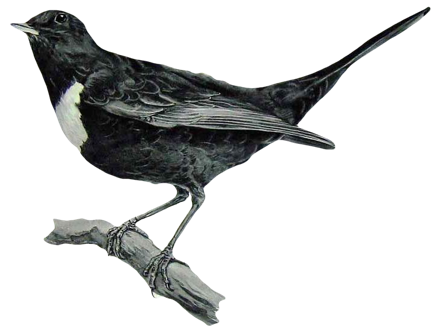

Ouzel or "Big Dumb Bird"
=====

Ouzel is a [Lady Blackbird](http://www.onesevendesign.com/ladyblackbird/) derivative RPG game. This is a working title for lack of anything better.

Lady Blackbird is a narrativist focused lightweight tabletop role-playing game (such as Dungeons and Dragons but with less rules and more talking). It weighs in at just 16 pages with characters.

Ouzel is a hack on Lady Blackbird to adapt it to a different setting for a mini-campaign. It focuses on being a science fiction game of discovery, exploration, and terror as our heroes encounter a Big Dumb Object (BDO) in space and are forced to explore it.

It will consist of setting notes, lightweight rules, and a series of sample characters with which to begin the game.

